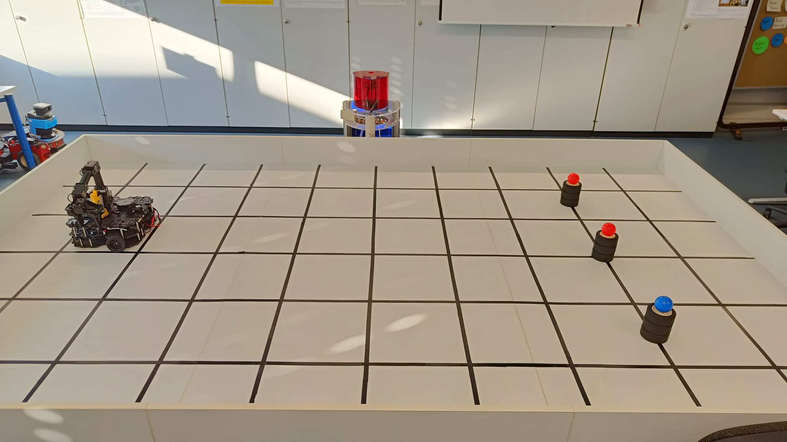

# Autonomous  ROS2 warehouse robot
This project involves the development of an autonomous warehouse robot using **TurtleBot3** and **OpenManipulator**, utilizing **ROS2** for _navigation_ and _manipulation_ tasks. The robot is equipped with mapping and localization functionalities via the `slam_toolbox` and `Nav2` packages, enabling efficient task execution in a warehouse environment. The system is capable of navigating to predefined waypoints, identifying products, and performing basic manipulation tasks, such as picking up and placing items.

## TurtleBot + VM setup
This section covers setting up the Virtual Machine (VM) and the TurtleBot3, including installing the necessary ROS2 packages and Python libraries. The VM provides significantly more computational power compared to the Raspberry Pi on the TurtleBot, making it ideal for running the robot's software stack, such as SLAM, navigation, and manipulation tasks, which require more processing resources. By leveraging the VM for computation, the Raspberry Pi can focus on handling the robot's hardware and sensors, ensuring smoother performance and more reliable operations during development and testing.

### TurtleBot
- [Install ROS2 Humble](https://docs.ros.org/en/humble/Installation/Ubuntu-Install-Debs.html) (only for Ubuntu 22.04.)
- **ROS2 packages:**
  - Packages for TurtleBot3: `sudo apt install ros-humbe-turtlebot3*`
  - colcon: `sudo apt install python3-colcon-common-extensions`
  - SetUp OpenManipulator: See Appendix [here](./static/paper.pdf)
- **Python packages:**
  - dotenv: `pip install python-dotenv`
- **warehouse_bot packages**
  - Clone this repository inside a new directory
  - Build packages (from inside new directory): `colcon build`
  - Source the underlying: `source <new_directory>/install/setup.bash`

### VM
- [Install ROS2 Humble](https://docs.ros.org/en/humble/Installation/Ubuntu-Install-Debs.html) (only for Ubuntu 22.04.)
- **ROS2 packages:**
  - colcon `sudo apt install python3-colcon-common-extensions`
  - rivz: `sudo apt install ros-humble-rviz2`
  - nav2: `sudo apt install ros-humble-navigation2 ros-humble-nav2-bringup`
  - slam_toolbox: `sudo apt install ros-humble-slam-toolbox`
  - Interfaces for OpenManipulator: `open_manipulator_msgs` (see above)
- **Python packages:**
  - dotenv: `pip install python-dotenv`
  - transitions: `pip install transitions`
- **warehouse_bot packages**
  - Clone this repository inside a new directory
  - Build packages (from inside new directory): `colcon build`
  - Source the underlying: `source <new_directory>/install/setup.bash`

## Starting the bot

### Environment 

  

    
    
    <i>[1] Environment Setup</i>
  

  

  
    
    <i>[2] Pillar Construction (red = wrong, blue = correct)</i>
  

  

  
    
    <i>[3] Bot starting postion</i>
  

---

Ensure the testing environment is set up properly: (For usage in KI-lab)
- TurtleBot (turned off) and pillars in correct position _(Figure 1)_
- 3 pillars made out of 3 tires each with balls on top (2 red, 1 blue) _(Figure 2)_
- OpenManipulator in correct position _(Figure 3)_
- Lights turned on (except for the light at the blackboard)

### Operating

**First steps**
- Turn on the TurtleBot and connect to it via SSH (`wtb`)

**Start the Bot itself** (on TurtleBot): `ros2 launch warehouse_bot warehouse_bot_tb_launch.py`
- Everything worked if `[open_manipulator.open_manipulator_x_controller]: Succeeded to Initialise OpenManipulator-X Controller` is logged during startup and `[image_provider]: image_provider successfully initialized!` is the last message you see in the console
- _Possible Error 1:_ `open VIDEOIO(V4L2:/dev/video0): can't open camera by index` -> restart
- _Possible Error 2:_ `[ERROR] [open_manipulator_x_controller-4]: process has died` -> restart using this command: `ros2 launch warehouse_bot warehouse_bot_tb_launch.py usb_port_open_manipulator:=/dev/ttyUSB0 usb_port_lds:=/dev/ttyUSB1`

**Start navigation and everything else**: (on VM): `ros2 launch warehouse_bot warehouse_bot_main_launch.py` (this can take a few seconds)
- Everything worked if the costmap has loaded successfully and the robot is displayed in rviz as seen in figure 4 below. If the robots position rviz is far off, you can use the "2D Pose Estimate" button to set the initial position. 
- The OpenManipulator should have moved to its idle pose (figure 5). If not, restart this and the previous launch file and ensure `[open_manipulator_controller] initialized successfully` is logged during startup

  

    
    
    <i>[4] Windows after correct startup</i>
  

  

  
    
    <i>[5] OpenManipulator idle pose</i>
  

**Start Operation**: `ros2 service call /begin_operation warehouse_bot_interfaces/srv/BeginOperation "{use_anchor: false}"`
- You can set `use_anchor: true` if you want to use poses in between. This _should_ make navigation more but seems to be causing problems since robot does not consistently position well in anchor state. Therefore it is not recommended to use. 
- _Possible Error:_ Sometimes the TurtleBot will beep one time and stop during navigation. This is probably due to low battery. Try changing the battery and restarting the bot. 

## Creating your own map 
- On TurtleBot: `ros2 launch warehouse_bot warehouse_bot_tb_launch.py`
- On VM: `ros2 launch warehouse_bot warehouse_bot_mapping_launch`
- On VM: `ros2 run turtlebot3_teleop teleop_keyboard`

Use the keyboard teleoperation to move the bot around to create a map. After that, you can save the map in rviz:

- Go to Panels > Add New Panel > SlamToolboxPlugin
- Save map as occupancy grid ("Save Map" button) aswell as posegraph ("Serialize" button)
- To use map for navigation: Change `map_file_name` in [mapper_params_localization](./src/warehouse_bot/config/mapper_params_localization.yaml)

## Misc
- use this to reset turtlebot movement: `ros2 topic pub --once /cmd_vel geometry_msgs/msg/Twist '{linear: {x: 0.0, y: 0.0, z: 0.0}, angular: {x: 0.0, y: 0.0, z: 0.0}}'`
- use this to open gripper of Open Manipulator `ros2 service call /open_manipulator/goal_tool_control open_manipulator_msgs/srv/SetJointPosition "{joint_position: {joint_name: ['gripper'], position: [0.01]}, path_time: 2.0}"`